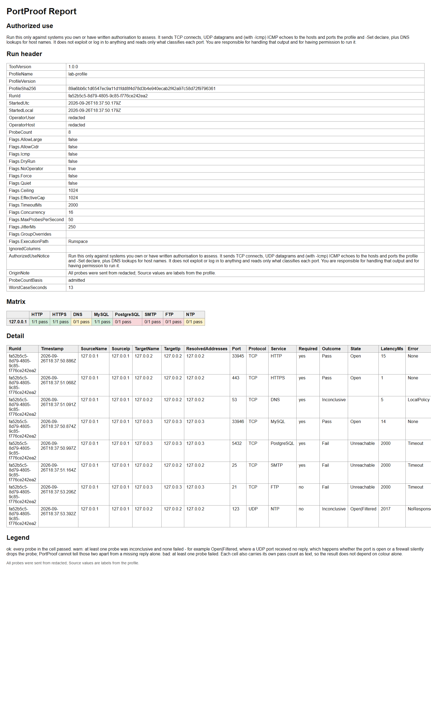

# PortProof

Prove a firewall rule set is open before the vendor arrives.

*by Hans Study — [hans.study/tools/portproof/](https://hans.study/tools/portproof/)*

[](https://github.com/hansstudy/portproof/releases/tag/v1.0.0)
[](https://github.com/hansstudy/portproof/releases/latest)
[](https://github.com/hansstudy/portproof/blob/main/LICENSE)
[](https://github.com/hansstudy/portproof/actions/workflows/ci.yml)
[](https://github.com/hansstudy/portproof/releases)
[](https://hans.study/tools/portproof/)

<!-- AUTHORIZED-USE-NOTICE: keep this text byte-identical to the copies in src/00-Header.ps1 and src/05-Contract.ps1; edit all copies together. -->
## Authorized use

Run this only against systems you own or have written authorisation to assess.
It sends TCP connects, UDP datagrams and (with -Icmp) ICMP echoes to the hosts and ports the profile and -Set declare, plus DNS lookups for host names. It does not exploit or log in to anything and reads only what classifies each port.
You are responsible for handling that output and for having permission to run it.

## What problem this solves

One PowerShell file, a profile in, a pass/fail matrix out. A vendor says "open these ports" the
week before a cutover, and the only way to know before go-live is to run something during the
change window. This exists because that check kept being the same three lines of throwaway
`Test-NetConnection` glued into a loop, with no artifact to show the change board afterwards.
PortProof takes a declared list of source-to-target-to-port requirements, probes each one exactly
once, and returns a pass/fail matrix instead of a screen of scrolling text.



## Quick start

```powershell
# 1. See what would run and how long it could take, without sending anything.
.\PortProof.ps1 -Profile profiles\ad-dc.csv -Set "CLIENT=10.10.1.50;DC=dc01.corp.example" -DryRun

# 2. Run it for real and write a report.
.\PortProof.ps1 -Profile profiles\ad-dc.csv -Set "CLIENT=10.10.1.50;DC=dc01.corp.example" -Out .\out

# 3. Open the result.
Start-Process .\out\portproof-report.html
```

Demo recording: [`docs/samples/run.gif`](docs/samples/run.gif). Sample console output:
[`docs/samples/console.txt`](docs/samples/console.txt).

## Install

Download `PortProof.ps1` from the
[latest release](https://github.com/hansstudy/portproof/releases/latest). This project ships one
script; there is no installer.

1. **Verify it first** (see [Verify this download](#verify-this-download)):
   ```powershell
   Get-FileHash -Algorithm SHA256 .\PortProof.ps1
   gh attestation verify PortProof.ps1 --owner hansstudy
   ```
2. Unblock the file. This alone is sufficient on a default `RemoteSigned` workstation:
   ```powershell
   Unblock-File .\PortProof.ps1
   ```
3. **Only if PowerShell still refuses to run it after `Unblock-File`** — typically because the
   machine's own execution policy is stricter than `RemoteSigned` — raise it to `RemoteSigned` for
   the current window only, never machine-wide, and never `Bypass` (which turns off signature
   checking entirely, rather than just accepting an unblocked local file):
   ```powershell
   Set-ExecutionPolicy -Scope Process -ExecutionPolicy RemoteSigned
   ```
   This is a last resort for this PowerShell window, not a permanent change. If you find yourself
   reaching for it routinely, your machine's default execution policy is worth revisiting instead.

## Usage

```powershell
# Directly, or from a caller script.
.\PortProof.ps1 -Profile .\profile.csv -Set "CLIENT=10.10.1.50;DC=dc01.corp.example,dc02.corp.example" -Out .\out -Format Html,Csv,Json

# From powershell.exe -File, e.g. inside a change-window gate:
powershell -File PortProof.ps1 -Profile .\profile.csv -Set "A=1;B=2" -Icmp -MaxProbes 200
```

- `-Set NAME=VALUE[,VALUE...][;NAME=VALUE...]` binds a profile's `%GROUP%` placeholders. Give every
  binding in **one** string joined with `;` (for example `"A=1;B=2"`) — PowerShell refuses
  `-Set A=1 -Set B=2` as the same named parameter given twice, and under `-File` an array argument
  arrives as a single string regardless, so this is the only form that works either way.
- `-Format Html,Csv,Json` is likewise one comma-separated string, not repeated switches.
- `-Icmp` adds one ICMP echo probe per distinct resolved target; it needs no additional privilege
  (see [Requirements / least privilege](#requirements--least-privilege)).
- `-DryRun` never resolves a name and never sends a probe; see
  [Output and exit codes](#output-and-exit-codes) for what it prints instead.
- `-AllowCidr` lets a `%GROUP%` binding be a single IPv4 CIDR block instead of a comma-separated
  list — any prefix from `/8` to `/32` (VLSM: a narrow point-to-point link and a wide LAN block are
  both legal). For example, a `/27` bound at the command line:
  ```powershell
  .\PortProof.ps1 -Profile .\profile.csv -Set "BRANCH=10.10.5.0/27" -AllowCidr -Out .\out
  ```
  expands `%BRANCH%` to the 30 usable host addresses in that block (the network and broadcast
  addresses excluded); `/31` expands to both addresses (RFC 3021) and `/32` to the one address
  itself. A prefix wide enough to expand past the effective cap is refused before any resolution or
  probing work happens — split it into narrower ranges, or run with `-AllowLarge`. See
  [Profile format](#profile-format) for the full CIDR rules.

## Profile format

See [`docs/profiles/schema.md`](docs/profiles/schema.md) for the full CSV/JSON column and key
reference, the closed value domains, the group syntax (including the CIDR/VLSM rules for
`-AllowCidr`), and the unknown-column policy.

## Bundled profiles

See [`docs/profiles/catalogue.md`](docs/profiles/catalogue.md) for the three profiles that ship
with v1 (Active Directory / domain controller reachability, SQL Server, RDP + WinRM), each with its
source citation and an example invocation.

## Output and exit codes

| Exit | Meaning |
|---|---|
| `0` | every `Required: yes` row is `Pass` (also `-Version`, and an admissible `-DryRun`) |
| `1` | a `Required: yes` row is `Fail` **or `Inconclusive`** — an inconclusive required row does not pass a change-window gate |
| `2` | a refused or malformed profile/argument, a cap exceeded, or an internal error; the console message names what to change |

Each row's `Error` field in the report explains *why* a non-`Open`/`Reply` `State` happened. The
values a reader will see:

| `Error` | Meaning |
|---|---|
| `None` | the probe classified normally (`Open`/`Reply`); nothing to explain |
| `ConnectionRefused` | TCP: the target actively refused the connection (RST) |
| `IcmpUnreachable` | UDP: an ICMP port-unreachable came back for the datagram |
| `Timeout` | PortProof's own wait expired with no response |
| `NoResponse` | UDP: silence within the timeout — indistinguishable from a filtered port |
| `HostUnreachable` | the network path itself reported unreachable, before reaching the target |
| `DnsFailure` | the name did not resolve; no probe was sent for this row |
| `ProbeError` | an unclassifiable adapter-level exception; treat as inconclusive |
| `LocalPolicy` | the operator host's own firewall, VPN, or endpoint-security software refused the attempt locally; nothing was sent to the network. `Outcome` is `Inconclusive` (a required row still `Fail`s the exit code) |

**A PowerShell parameter-binding error is not one of PortProof's exit codes.** An unknown parameter
name or a value PowerShell cannot convert (`-MaxProbes abc`, a parameter given twice) is rejected by
PowerShell *before PortProof ever runs*, and PowerShell itself exits **1** for that — the same code
PortProof uses for "a required path failed". PortProof cannot change this; it is also documented in
`Get-Help .\PortProof.ps1` (`.NOTES`).

**This matters for automated gates.** `powershell -Command "& .\PortProof.ps1 ...; exit
$LASTEXITCODE"` does not reliably reflect a parameter-binding error: when PowerShell refuses to bind
and never calls PortProof at all, `$LASTEXITCODE` is left whatever it already was (often 0, from
nothing at all having run), so a gate that only checks `$LASTEXITCODE` after a `-Command` invocation
can see a stale 0 and wave a broken invocation through as a pass. **Do not "fix" this by putting
`if (-not $?) {...}` inside the same double-quoted `-Command` string** — `$?` and `$LASTEXITCODE`
inside a double-quoted string are expanded by the *calling* shell before that string is ever handed
to the child PowerShell, so the child receives their stale values baked in as literal text (typically
malformed code), not a live check. Use one of the two tested forms below instead.

**From a calling PowerShell script or session — call it in-process and check `$?` immediately,
before running any other command (including a diagnostic `Write-Output`), since any command at all
resets `$?`:**

```powershell
& .\PortProof.ps1 -Profile .\profile.csv -Out .\out
$succeeded = $?          # capture this first, on the very next line - nothing else in between
$code = $LASTEXITCODE    # for logging only: see the warning below
if (-not $succeeded) {
    Write-Error "PortProof gate failed (last exit code: $code)"
    exit 1
}
```

`$LASTEXITCODE` alone is **not** a safe check here: a parameter-binding error never runs PortProof,
so `$LASTEXITCODE` is left untouched at whatever it already was (`$null` in a fresh session, or a
stale value from an earlier call in the same session) — it is `$?` that reliably goes `$false` for
every failure mode (a required-path failure, a refusal, *and* a binding error). Tested against a
stand-in script on Windows PowerShell 5.1: an exit-0 run gives `$succeeded = $true`; an exit-2 run
gives `$succeeded = $false, $code = 2`; a bad-value binding error (`-MaxProbes abc`) and an unknown
parameter both give `$succeeded = $false` with `$code` left stale from whatever ran before.

**From `-File` (works identically from a PowerShell script, `cmd.exe`, or a scheduler, because the
process's own exit code carries the result — nothing to expand, nothing to get wrong):**

```powershell
powershell -NoProfile -File PortProof.ps1 -Profile .\profile.csv -Out .\out
if ($LASTEXITCODE -ne 0) { <fail the change window> }
```

```bat
:: from cmd.exe or a scheduled task's own script - check %ERRORLEVEL% on its own line, never
:: joined to the powershell call with "&", which expands %ERRORLEVEL% before powershell runs
powershell -NoProfile -File PortProof.ps1 -Profile .\profile.csv -Out .\out
if %ERRORLEVEL% NEQ 0 ( echo GATE FAILED & exit /b 1 )
```

Tested on Windows PowerShell 5.1, both as a direct child process and via `cmd /c`: exit-0 gives
`0`; exit-2 gives `2`; a bad-value binding error and an unknown parameter both give `1` — a clean,
single number, propagated exactly, with no `$?`/stale-value gotcha at all. This is why `-File` is
the form recommended for anything outside an interactive PowerShell session.

**Change-window gates must invoke PortProof with `-File` (simplest — check the process exit code
directly), or, if calling it in-process from PowerShell, check `$?` immediately after the call as
shown above** — never `-Command "...; exit $LASTEXITCODE"` alone, and never `if (-not $?)` embedded
inside the same double-quoted `-Command` string.

**Output.** With `-Out`, PortProof writes `portproof-report.html`, `portproof-results.csv`, and/or
`portproof-results.json` (whichever `-Format` names; all three by default) into that directory,
refusing to overwrite an existing file unless `-Force` is given. Without `-Out`, a single
`-Format Csv` or `-Format Json` goes to the success stream (pipe it: `-Format Json |
ConvertFrom-Json`); `-Format Html`, or more than one format, without `-Out` is an argument error,
since there is nowhere to put more than one document. The success stream carries only that one
document (or, with `-Version`, the version string) — every notice, header, progress and summary
line goes to the information/progress streams instead, so a pipeline consumer never has to filter
chatter out of the result.

Reading the CSV back: the run header occupies the first lines as `"#Field","value"` records, so
strip them before parsing the table:

```powershell
Get-Content .\out\portproof-results.csv | Where-Object { $_ -notlike '"#*' } | ConvertFrom-Csv
```

## How it probes

PortProof makes **exactly one connection attempt per probe, and never retries.** That is not the
same claim as "one packet per probe": Windows itself retransmits an unanswered TCP SYN (two
retransmissions by default) inside the connect timeout, so a single attempt against a filtered port
can put as many as three SYNs on the wire. "One connection attempt" is the claim PortProof makes;
"one packet" is not.

Every probe is a full TCP connect (`TcpClient.BeginConnect`) or a single zero-length UDP datagram —
never a SYN-only/half-open scan, never a payload, never a banner read. TCP has no ambiguous state: a
completed handshake is `Open`, a reset is `Closed`, a timeout is `Unreachable`. UDP is inherently
ambiguous — most stacks stay silent on both an open and a filtered port — so a UDP probe that times
out is reported `Open|Filtered`, never `Open`. **`Open|Filtered` means PortProof could not tell the
difference, not that the port is open**; treat it as inconclusive, not as a pass.

**On Windows, a closed TCP port can take about two seconds to report `Closed` at all**, because the
OS's own TCP stack retries the SYN internally before surfacing the RST-based refusal to the calling
application — measured at roughly 2.0 s regardless of how quickly the far side actually resets the
connection. At the default `-Timeout 2000`, PortProof's own wait can therefore expire first, so a
genuinely closed port reads `Unreachable`/`Timeout` instead of `Closed`/`ConnectionRefused` (measured:
`Timeout` at `-Timeout 500` and `-Timeout 1000`; `Closed` only after ~2005 ms at `-Timeout 3000`).
This does **not** change whether the row `Fail`s — both states map to `Fail` for a required TCP row
— but it does mean the *state* column cannot be trusted to tell "closed" from "genuinely
filtered/unreachable" at the default timeout. If that distinction matters to you, raise `-Timeout`
to roughly 2500 ms or more so Windows's retry-then-refuse sequence has time to finish; the trade-off
is run time, since every probe that is actually filtered or unreachable now waits out the longer
timeout too, and the worst-case duration in [Limitations](#limitations) scales with it. This is
Windows-specific behaviour, measured on Windows only — other operating systems' TCP stacks were not
tested and may report a refused connection sooner.

**All probes originate from the operator host running PortProof.** A profile's `Source` values are
labels for the path being proven (which upstream role or segment this row represents), not a
socket-level source address — PortProof has no multi-source or remote-execution mode in v1. The run
header and every report state: "All probes were sent from `<host>`; Source values are labels from
the profile."

A hostname resolves to **exactly one address** — the first one returned; every other address the
resolver returned is recorded, never probed. Two profile rows that resolve to the same
`(address, port, protocol)` are probed **once**, and the one result is shared across both rows — a
5-source-by-200-row profile therefore spends 200 probes against the cap, not 1,000.

## Why not PSnmap / nmap / PortQry / Test-NetConnection

**[PSnmap](https://www.powershellgallery.com/packages/PSnmap)** (EliteLoser / Svendsen Tech) is the
closest prior art, and naming it first is the honest way to start this comparison: a pure-PowerShell,
no-DLL module with over 130,000 PowerShell Gallery downloads and a decade of use — the
most-adopted port-scanning module in the PowerShell ecosystem. It is genuinely good at what it does,
and PortProof is not trying to replace it.

| | PSnmap (and similar discovery tools) | PortProof |
|---|---|---|
| Question answered | "What is open across this range?" | "Is the specific set of paths this system requires open — yes or no?" |
| Input | A CIDR range and/or a port list | A declared source→target→port **requirement matrix**, with a `Required` flag per row |
| Output | A discovery table | A pass/fail matrix keyed to named services |
| Exit behaviour | None specific to a requirement | Non-zero exit on a failed **required** path, so it can gate a change window |
| Range sweeps / host discovery | Yes — that is the point | Refused, permanently — a declared list only |

This is a **discovery-versus-validation** distinction, not a quality claim. PSnmap and tools of the
same shape (`santisq/PSNetScanners` included) answer "what's out there"; PortProof only ever answers
"is the thing already declared as required actually reachable". The genuine overlap is the probing
engine itself, which is conceded rather than dressed up — PortProof's contribution is the
requirement-matrix model and the bundled vendor profile catalogue, not the act of opening a socket.

- **`Test-NetConnection`** (built into Windows) — one host, one port, per invocation, with a slow
  default timeout; no matrix, no report, no exit-code semantics. Everyone wraps it in a throwaway
  loop; PortProof is that loop, kept.
- **PortQry / PortQryUI** (Microsoft) — still recommended in support articles because nothing
  replaced it, but it is an unsigned legacy executable copied host to host, producing console text,
  not an artifact.
- **nmap** — excellent, and the wrong tool for this job: it has to be installed, it is flagged by
  endpoint protection, and running it unannounced on a client network is a career event; it also
  answers "what is open" rather than "is the required list open".

## Requirements / least privilege

- Windows PowerShell 5.1, or PowerShell 7.4 and later.
- **No administrator rights are needed for any probe PortProof makes, including with `-Icmp`.** TCP
  probing is a full user-mode connect (`TcpClient.BeginConnect`); UDP is a user-mode datagram
  send/receive; ICMP echo uses `System.Net.NetworkInformation.Ping`, which does not require raw
  sockets or elevation on Windows. Run PortProof as whatever account can already reach the network
  paths it is proving — nothing more.
- Outbound network access to the targets a profile declares, and nothing else PortProof needs (see
  [Telemetry](#telemetry)).

## Limitations

- **Worst case is slow, by design.** PortProof serialises probes per target and never retries, so a
  profile declaring many probes against one unreachable target takes a long time. The estimate
  (also printed by `-DryRun`) is an upper bound: `seconds = ceil((D + max(N / R, W / C +
  max_target_wait)) / 1000)`, where `D` is the sequential name-resolution term, `N` the probe count,
  `R` the rate limit, `W` the summed per-target wait, and `C` the concurrency. At the defaults, 1,024
  probes against one unreachable target print an estimate of roughly 41 minutes. This is the
  politeness guarantee (rate limit, concurrency cap, no retry) doing its job, not a hang — check the
  `-DryRun` estimate before assuming a long run has stalled.
- **The refused-address-class check on a resolved name happens on the live run, not on `-DryRun`.**
  `-DryRun` performs no name resolution at all, so a name that would resolve to a refused address
  (this-network, broadcast, multicast, link-local) cannot be caught before the live run; the DryRun
  report marks such rows `unresolved (dry-run)` rather than pretending to classify them.
- **Single-label and `.local` names can trigger multicast name resolution, which is not a probe.**
  Windows resolves a single-label host name or a `.local` name by falling back to LLMNR, NetBIOS,
  and/or mDNS multicast queries before or alongside ordinary DNS. That traffic is not something
  PortProof sends deliberately — it is the operating system's own resolver — but it reaches network
  classes PortProof otherwise refuses to target. Use a fully-qualified domain name or an IP literal
  to avoid it.
- **A `*.ipv6-literal.net` name is refused outright, not resolved.** Windows maps this name form to
  an IPv6 literal locally, without a DNS query, which would otherwise let a target reach a refused
  address class without ever passing through the resolved-address class check. PortProof refuses
  any target ending `.ipv6-literal.net` at parse time; write the IPv6 literal address instead.
- **An own-host name can resolve to a refused-class address without any DNS query at all.** The
  local machine name, `localhost`, and similar own-host names resolve through the local host's own
  name-resolution stack rather than a network DNS lookup, and can return a link-local or
  loopback-adjacent address such as `fe80::...` or `169.254.x.x`. Unlike the `.ipv6-literal.net`
  case above, PortProof cannot refuse this at parse time — it is an ordinary hostname — so it is
  refused by the Gate on the **live run**, exactly like any other resolved refused-class address.
  `-DryRun`, which performs no resolution, may report the same row as simply `unresolved
  (dry-run)`, so the DryRun report and the live run's decision can disagree for a name that is, in
  fact, entirely deterministic and local.
- **IPv6 forms that embed an IPv4 address are checked against the IPv4 refused classes.** `::/96`,
  `::ffff:0:0/96`, `64:ff9b::/96`, and 6to4/Teredo forms are checked the same way a plain IPv4
  literal is, so an embedded this-network, broadcast, multicast, or link-local address is refused
  rather than admitted just because the wrapper looks like an ordinary IPv6 address.
- **A subnet's directed-broadcast address cannot be recognised as such without knowing the
  subnet's netmask.** PortProof refuses the *global* broadcast address (`255.255.255.255`) and
  every expanded CIDR's own network/broadcast pair, but a directed-broadcast literal typed for a
  subnet PortProof was never told about (for example `192.168.1.255` outside any declared CIDR) is
  an ordinary-looking host address to the parser and is admitted. This is a residual, not a
  refused class: PortProof has no way to know a bare literal is a subnet's broadcast address
  without the netmask that defines it.
- **A vendor-supplied (or otherwise third-party) profile is a request to scan, not just data.**
  Whoever hands you a profile chooses every target and port it declares — PortProof probes exactly
  what it is given, and a profile from a vendor, a colleague, or any other source you did not write
  yourself can point it at anything on your network the operator host can reach that is not a
  refused address class. Read a profile you received before running it, and review the `-DryRun`
  target list first; prefer literal addresses over names you have not verified.
- **Resolving the names in a profile is itself a signal, independent of any probe.** Each hostname
  is a DNS (or LLMNR/mDNS) query to whoever serves that name, before any TCP/UDP/ICMP probe is
  sent — so a profile author who controls the DNS zone for a name in their own profile learns that
  the profile was run, and roughly when, regardless of what the probe results say. This is not
  telemetry PortProof sends on its own behalf, but it is outbound signal the
  [Telemetry](#telemetry) section does not otherwise describe.
- **The operator host's own VPN client or endpoint-security software can block an outbound probe
  before it ever reaches the network — measured on Windows.** DNS-leak protection in particular
  commonly blocks outbound TCP/UDP port 53 regardless of the target. A row blocked this way reads
  `LocalPolicy` (TCP) or `Open|Filtered` (UDP) — see [Output and exit codes](#output-and-exit-codes)
  — and says nothing whatsoever about the target's own firewall or listener state. If you need a
  trustworthy read on a port your own host's software might intercept (port 53 especially), run
  PortProof from a host without that VPN client or endpoint-security product installed, or disable
  the feature that intercepts it for the duration of the run.
- No listener mode. PortProof only opens outbound connections from the operator host; it never opens
  a port to receive anything, and multi-source or remote-execution scanning is not part of v1.
- No general output redaction. See [Output sensitivity](#output-sensitivity).

## Output sensitivity

PortProof's output is, by design, a map of which network paths into a system are open — that is the
deliverable. Treat every report file the way you would a network diagram: it names hosts, IP
addresses, the ports probed, and, unless `-NoOperator` is given, the operator's user name and host
name. **There is no general redaction feature in v1** — `-NoOperator` replaces `OperatorUser` and
`OperatorHost` with `redacted` and nothing else is redacted. Decide, before you run it, who is
allowed to see the resulting file and where it is allowed to end up. See
[`docs/threat-model.md`](docs/threat-model.md).

## Verify this download

This release is not Authenticode-signed. Windows SmartScreen may warn on first run because of this
— that is expected, not a sign of tampering. Verify the download instead:

1. Compute the hash: `Get-FileHash -Algorithm SHA256 .\PortProof.ps1`
2. Compare it against the published `SHA256SUMS` for this release.
3. Verify build provenance: `gh attestation verify PortProof.ps1 --owner hansstudy`

See [`docs/verify-downloads.md`](docs/verify-downloads.md) for the exact commands and why there is
no Authenticode signature yet.

## Security

See [`SECURITY.md`](SECURITY.md). This repo overrides the account-level default with one
tool-specific scope statement: **PortProof scans ports; that it does so is not a vulnerability.**
In scope: escaping/injection in a rendered report, output containment failures, a way to bypass the
probe cap, a `-NoOperator`/`-DryRun` leak, or probing beyond what the profile declares. Report
privately via **GitHub private vulnerability reporting** (this repo's Security tab -> "Report a
vulnerability") or email **bugs@hans.study**, never in a public issue.

## Contributing a profile

A profile row may be added **only** from public, non-authenticated vendor documentation. Record the
source URL and retrieval date in the profile's `*.provenance.json` sidecar and in
[`docs/profiles/catalogue.md`](docs/profiles/catalogue.md) at authoring time. Partner-portal copies,
licensed documentation, NDA material, and internal customer deployment records are not acceptable
sources, even where the same fact is also published publicly elsewhere — provenance cannot be
reconstructed after the fact. See [`docs/content-provenance.md`](docs/content-provenance.md).

## Support

This is published as working software, not as a supported product. Issues and pull requests are
read and are usually answered within a week. There is no SLA. If you need this run, tuned, or
backed by a person, that is consulting work - [start here](https://hans.study/start-an-engagement/).

## Telemetry

This tool collects no telemetry. It does not phone home, does not call any analytics endpoint, and
does not transmit anything about its use to anyone, including the maintainer. Everything it produces
stays on the machine it ran on.

## Trademark disclaimer

Microsoft, Windows Server, Active Directory and SQL Server are trademarks of their respective
owners. This project is independent and is not affiliated with, endorsed by, or supported by those
owners.

## Third-party content

This repo's licence covers only material Hans Study authored. See
[`docs/content-provenance.md`](docs/content-provenance.md) for what third-party content (if any)
this project references and under what terms.

## Licence

Apache-2.0. See [`LICENSE`](LICENSE) and [`NOTICE`](NOTICE).
